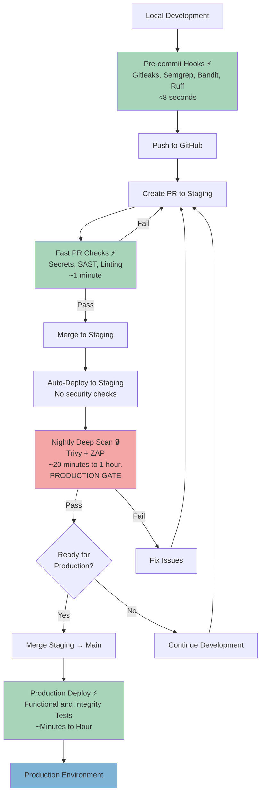

# Reusable RAG Engine

A modular Retrieval-Augmented Generation (RAG) engine designed to power question-answering services across multiple, independent knowledge bases.

## Overview

**rag-engine** provides a configurable pipeline for document ingestion, text chunking, vector embedding, semantic retrieval, and grounded LLM generation. The project emphasizes reusability, clean abstractions, and production-style deployment.

## Security Gates Across the SDLC

### Philosophy: Developer-Friendly Shift-Left Security

**Shift-left security succeeds when it respects developer time.** We integrate security early—during design, coding, and CI. Developers should get fast, actionable feedback without leaving their flow.

**What Developer-Friendly Means:**
- ⚡ **Fast feedback**: Seconds (not minutes) for inner-loop checks
- 🎯 **Low noise**: High-signal rules first; phase in stricter ones gradually
- 🔄 **In-flow**: IDE, pre-commit, PR checks—no context switching
- 📋 **Transparent**: Policies as code; exceptions time-bound and auditable
- 📚 **Learning-oriented**: Every failure teaches the fix

**Strategy:**
- Keep **fast checks in the inner loop** (pre-commit, PR) for immediate feedback
- Move **heavy analysis to nightly scans** off the critical path
- Encode **policy so decisions are visible and auditable**
- Favor **modular, open-source tools** to avoid vendor lock-in; upgrade to enterprise where it clearly pays off.

### Security Pipeline Overview



**Legend:** ⚡ Fast (<2 min) | 🔒 Deep Scan (Production Gate)

**Quick Summary:**
1. **Local** - Pre-commit hooks catch secrets/basic issues (<1s)
2. **PR** - Fast comprehensive checks (~1 min) validate safety before merge
3. **Staging** - Auto-deploy immediately (no additional gates)
4. **Nightly** - Deep scans (Trivy, ZAP) run off critical path, **REQUIRED before production**
5. **Production** - Fast deploy (~1-2 min) with functional tests

**Result:** Developers stay productive with **single-pass PR checks** while comprehensive security coverage runs nightly as the mandatory production gate.

### 1. Local: Pre-commit Hooks ⚡ (<8 seconds)

**Purpose:** Instant feedback before code enters version control. Configured via [.pre-commit-config.yaml](.pre-commit-config.yaml)

**Active Hooks:**
- **✅ Gitleaks** - Secrets detection (API keys, tokens, passwords)
- **✅ Semgrep** - Multi-language SAST (`p/ci` ruleset: high-signal, low false-positives)
- **✅ Bandit** - Python security (high-severity only to reduce noise)
- **✅ Ruff** - Fast Python linting + auto-formatting (100x faster than traditional tools)
- **✅ Pre-commit-hooks** - File hygiene (YAML syntax, trailing whitespace, EOF newlines)

**Setup:**
```bash
pre-commit install              # Auto-run on every commit
pre-commit run --all-files      # Manual scan of entire codebase
```

**Philosophy:** Defense-in-depth with complementary tools. Semgrep catches broad patterns; Bandit specializes in Python anti-patterns. Both configured for high-signal output to respect developer time.

### 2. Pre-push: GitHub Push Protection ✅

**GitHub Push Protection** blocks known secret patterns from reaching repository history (GitHub-side enforcement).

**Note:** If secrets already exist in commit history, use interactive rebase to remove them or create a fresh branch from main.


### 3. Staging Branch: Fast PR Checks + Nightly Validation

**Strategy:** Single comprehensive PR check → immediate deployment on merge. Deep scans run nightly off the critical path.

#### 3a. Pull Request: Fast Security Gate ⚡ (~1 minute)

**Workflow:** [pr-fast-checks.yml](.github/workflows/pr-fast-checks.yml)
**Purpose:** Is this safe to merge AND deploy? Complete validation in developer's flow.

**Active Checks:**
- **✅ Gitleaks** - Secrets scan (~10s)
- **✅ Semgrep** - SAST with `p/ci` ruleset (~30s)
- **✅ Bandit** - Python security, high severity only (~15s)
- **✅ Ruff** - Python linting (~5s)
- **✅ CodeQL** *(GitHub Security)* - Semantic SAST with data flow analysis (auto-enabled, free for public repos)

**Gate Behavior:** All checks must pass. On merge → **auto-deploy to staging** (no additional gates).

**Future:** Lightweight fuzzing (5-15 min) on new endpoints only.

#### 3b. Nightly Deep Scan — **REQUIRED PRODUCTION GATE** ✅

**Workflow:** [nightly-deep-scan.yml](.github/workflows/nightly-deep-scan.yml) | **Time:** ~20 minutes to 1 hour.

**Trigger:**
- **Production gate**: Push to `staging` branch (staging → main merge **BLOCKED** until this passes)
- **Scheduled**: Nightly at 2 AM for comprehensive analysis
- **Manual**: workflow_dispatch for on-demand deep scans

**Philosophy:** Deep, time-intensive scanning runs off the critical path (nightly) while serving as the mandatory security gate before production. Branch protection **requires** this workflow to pass before staging → main merges are allowed.

**Active Scans:**
- **✅ Trivy Multi-Layer Scanning** - Container and infrastructure security (fails on CRITICAL/HIGH):
  - **Image Scan**: Analyzes the actual Docker image pushed to GitHub Container Registry (`ghcr.io`), not just source code
    - Base image (python:3.11-slim) OS vulnerabilities
    - Debian system packages
    - Python dependencies from requirements.txt
    - All runtime libraries
    - Layer-by-layer analysis pinpoints exactly where vulnerabilities originate
  - **Filesystem Scan**: Repository infrastructure and configuration
    - IaC misconfigurations (Dockerfile, Docker Compose, Kubernetes)
    - Hardcoded secrets and sensitive data
    - License compliance (GPL, proprietary licenses)
  - **Value**: What you scan is what you ship — same artifact used for scanning, testing, and deployment

- **✅ OWASP ZAP** - Deep DAST against `https://rag-engine-staging.fly.dev` (fails on HIGH/MEDIUM):
  - XSS, SQL injection, authentication bypasses
  - Authorization flaws, insecure configurations
  - Runtime vulnerabilities static analysis cannot detect

**Commented Out (Planned):**
- **❌ Semgrep Full Rulesets** - `p/r2c-security-audit`, `p/secrets`, `p/python`, `p/docker`
- **❌ Bandit High Severity** - Python security, high severity only
- **❌ OWASP Dependency-Check** - Comprehensive SCA, CVSS 7.0+ threshold
- **❌ Deep Fuzzing** *(planned)* - 1-2 hour API fuzzing against ephemeral environment

**Failure Policy:** Only CRITICAL/HIGH severity findings block production. Medium/low findings reported to GitHub Security tab but don't prevent deployment.

### 4. Staging Environment

**Deployment:** [deploy-staging.yml](.github/workflows/deploy-staging.yml) → immediate Fly.io deployment (no security gates—already validated in PR).

**Runtime Testing:** See Section 3b—OWASP ZAP DAST runs nightly against this environment.

**Future:** SBOM generation (Syft), Falco runtime monitoring (eBPF-based threat detection).

### 5. Production: Fast Deploy ⚡ (~1-2 minutes)

**Workflow:** [deploy.yml](.github/workflows/deploy.yml) | **Trigger:** `staging` → `main` merge

**Steps:**
- **✅ pytest** - Functional tests (~30-60s)
- **✅ Fly.io deploy** - Production deployment (~30-60s)

**Security Philosophy:** Zero redundant scans. Branch protection **requires nightly-deep-scan.yml to pass** before allowing staging → main merge. All critical/high findings already validated.

**Protection Layers:**
1. **PR to staging** - Fast checks (pr-fast-checks.yml)
2. **Staging → main** - Deep scan required (nightly-deep-scan.yml) **MUST PASS**
3. **Main deploy** - Functional tests only

**Future:** SLSA Provenance for supply chain attestation. Provides cryptographic, verifiable proof of how, where, and from what source code an artifact was built, reducing the risk of tampering or unauthorized modifications in the software supply chain. It enables organizations to detect compromised build pipelines, enforce trusted build policies, and strengthen deployment integrity. In short, it converts build trust from implicit to cryptographically verifiable.

### 6. Production: Runtime Monitoring ❌ *(planned)*

**Falco** - CNCF-graduated eBPF-based runtime threat detection (deployed on Fly.io, not in GitHub Actions):
- Reverse shells, privilege escalation, crypto mining
- Unauthorized file access, container escapes
- Suspicious network connections

**How it works:** Continuous kernel-level monitoring → alerts to incident response (Slack, PagerDuty).
**vs. DAST:** ZAP probes for vulnerabilities; Falco detects active exploitation.
