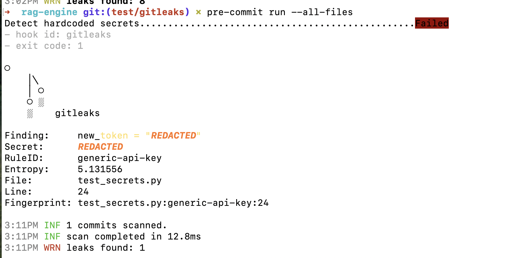
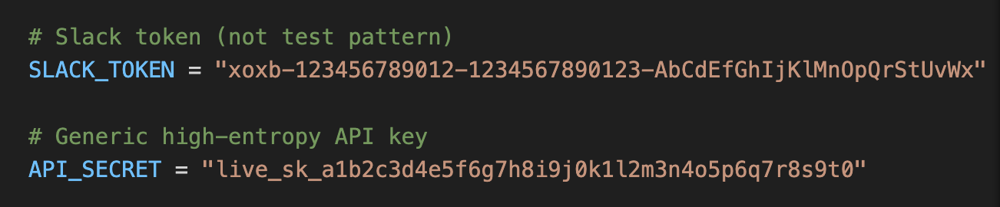
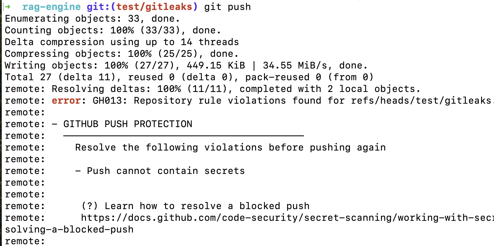

# Reusable RAG Engine

A modular Retrieval-Augmented Generation (RAG) engine designed to power question-answering services across multiple, independent knowledge bases.

## Overview

**rag-engine** provides a configurable pipeline for document ingestion, text chunking, vector embedding, semantic retrieval, and grounded LLM generation. The project emphasizes reusability, clean abstractions, and production-style deployment.

## Security Checks Across the SDLC

### 1. Pre-commit (Local)
**GitLeaks** provides local and offline scanning to catch secrets before they're committed:
- Helps debug false positives
- Tests new detection logic locally
- Command: `gitleaks detect --source .` scans using built-in default rules
- Optional: Use `--config .gitleaks.toml` for custom allowlists and rules

**Husky + Playwright** *(planned)* - Automated security testing framework for pre-commit hooks. Would execute Playwright-based security tests locally before commits, ensuring security checks run even before code reaches the repository.

### 2. Pre-push (GitHub)
**GitHub Push Protection** blocks real-looking secrets from known providers before they reach the repository history.
- Note: Push Protection will block if secrets exist in previous commits. In that scenario, one option is to remove the commits containing secrets from history through an interactive rebase. Or, if your secrets haven't been committed yet, stash your non-problematic files and commit them into a new branch from main. This second option is cleaner and avoids any risk of pushing secrets, but requires that your secrets haven't been committed yet.

### 3. Post-push (GitHub Actions)

**Pull Request Security Checks** ([security.yml](.github/workflows/security.yml))
Runs comprehensive security analysis on all pull requests before merging:
- **GitLeaks GitHub Action** - Scans commits in pull requests and pushes to main
- **Bandit** - Python SAST for security vulnerabilities
- **pip-audit** - Python package vulnerability auditing via OSV database.
- **OWASP Dependency-Check** - Software Composition Analysis (SCA) for CVEs. Analyzes dependencies and compile report of well-known, publicly disclosed vulnerabilities. Report contains any Common Platform Enumeration (CPE) identifiers that are found for a given dependency.
- **Ruff** - Fast Python linter
- **CodeQL** *(planned)* - Static code analysis for security vulnerabilities

### 4. Build Stage *(planned)*
**SBOM Generation & Vulnerability Scanning**
- **Syft** - Cloud-native SBOM generator that produces a comprehensive Software Bill of Materials listing all packages, versions, licenses, and hashes. Supports industry standards (CycloneDX & SPDX) and would be integrated in GitHub Actions during the build stage. Enables security and compliance teams to track exactly what's shipped in each release, making it trivial to identify affected systems during zero-day vulnerability disclosures.
- **Grype** - SBOM-based vulnerability scanner that consumes Syft-generated SBOMs to detect CVEs in built artifacts and container images. Deployed in the build pipeline after SBOM generation, it scans what's actually being shipped (not just source code), catching vulnerabilities in transitive dependencies and compiled artifacts. This build → generate SBOM → scan SBOM → deploy workflow represents industry best practice for AppSec.
- **Trivy** - All-in-one container security scanner for containerized deployments. Scans Docker images for vulnerabilities, misconfigurations, and secrets before pushing to registries. Would run in CI/CD pipeline during container build stage to prevent vulnerable images from reaching production.

### 5. Test Stage *(planned)*
**Dynamic Application Security Testing (DAST)**
- Runtime security testing to scan running applications and APIs for vulnerabilities that only manifest during execution, such as authentication flaws, injection vulnerabilities, and insecure configurations.
- **OWASP ZAP** *(planned)* - Containerized lightweight DAST scanner that runs automated security scans against the staging environment after PR merge and deployment. Tests the running application in a production-mirror environment to detect runtime vulnerabilities like XSS, SQL injection, authentication bypasses, and insecure configurations before production release.

### 6. Release Stage
**Deployment Security Gate** ([deploy.yml](.github/workflows/deploy.yml))

Re-runs all security checks on direct pushes to main before deployment as a final safety net. Deployment only proceeds if all security checks pass, preventing vulnerable code from reaching production.

**Container & Artifact Security** *(planned)*
- Container image scanning and artifact verification to ensure only secure, verified builds reach production environments.

**Runtime Threat Detection** *(planned)*
- **Falco** - CNCF-graduated eBPF-based runtime security monitoring for containerized applications. Detects active exploitation attempts and suspicious behavior in running containers that static analysis cannot catch, including reverse shells, privilege escalation, crypto mining, unauthorized file access, and container escape attempts. Deployed as a DaemonSet in production Kubernetes clusters or sidecar container, it monitors kernel-level events in real-time with minimal overhead. Alerts integrate with logging/monitoring stacks (Slack, PagerDuty, CloudWatch) to enable immediate incident response when runtime attacks occur.

### 7. Supply Chain Security *(planned)*
**SLSA Framework Implementation**
- **SLSA (Supply-chain Levels for Software Artifacts)** - Framework to protect the integrity of the software supply chain through signed provenance. Cryptographically proves how an artifact was built, including the source, build system, and steps involved. Prevents tampering in the CI/CD pipeline, enables supply-chain trust, and enforces deployment policies so only verified, compliant artifacts reach production.
- Protects against build pipeline attacks such as locally-built artifacts bypassing CI/CD, compromised CI runners, and malicious dependencies injected at build time. GitHub Actions can generate provenance JSON for verification. 