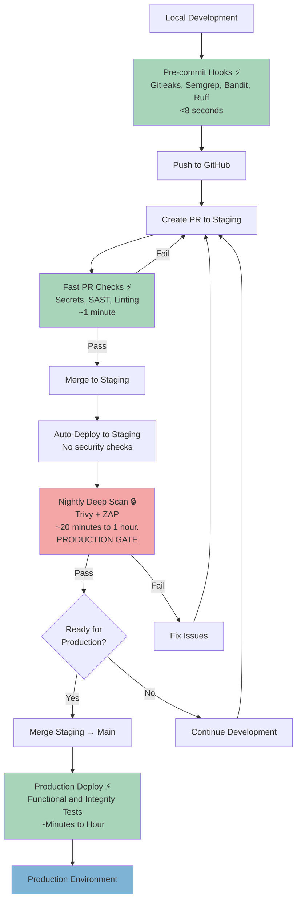

# Reusable RAG Engine

A modular Retrieval-Augmented Generation (RAG) engine designed to power question-answering services across multiple, independent knowledge bases.

## Overview

**rag-engine** provides a configurable pipeline for document ingestion, text chunking, vector embedding, semantic retrieval, and grounded LLM generation. The project emphasizes reusability, clean abstractions, and production-style deployment.

## Security Gates Across the SDLC

### Philosophy: Developer-Friendly Shift-Left Security

**Shift-left security succeeds when it respects developer time.** We integrate security early—during design, coding, and CI. Developers should get fast, actionable feedback without leaving their flow.

**What Developer-Friendly Means:**
- ⚡ **Fast feedback**: Seconds (not minutes) for inner-loop checks
- 🎯 **Low noise**: High-signal rules first; phase in stricter ones gradually
- 🔄 **In-flow**: IDE, pre-commit, PR checks—no context switching
- 📋 **Transparent**: Policies as code; exceptions time-bound and auditable
- 📚 **Learning-oriented**: Every failure teaches the fix

**Strategy:**
- Keep **fast checks in the inner loop** (pre-commit, PR) for immediate feedback
- Move **heavy analysis to nightly scans** off the critical path
- Encode **policy so decisions are visible and auditable**
- Favor **modular, open-source tools** to avoid vendor lock-in; upgrade to enterprise where it clearly pays off.

### Security Pipeline Overview



**Legend:** ⚡ Fast (<2 min) | 🔒 Deep Scan (Production Gate)

**Quick Summary:**
1. **Local** - Pre-commit hooks catch secrets/basic issues (<1s)
2. **PR** - Fast comprehensive checks (~1 min) validate safety before merge
3. **Staging** - Auto-deploy immediately (no additional gates)
4. **Nightly** - Deep scans (Trivy, ZAP) run off critical path, **REQUIRED before production**
5. **Production** - Fast deploy (~1-2 min) with functional tests

**Result:** Developers stay productive with **single-pass PR checks** while comprehensive security coverage runs nightly as the mandatory production gate.

### 1. Local: Pre-commit Hooks ⚡ (<8 seconds)

**Purpose:** Instant feedback before code enters version control. Configured via [.pre-commit-config.yaml](.pre-commit-config.yaml)

**Active Hooks:**
- **✅ Gitleaks** - Secrets detection (API keys, tokens, passwords)
- **✅ Semgrep** - Multi-language SAST (`p/ci` ruleset: high-signal, low false-positives)
- **✅ Bandit** - Python security (high-severity only to reduce noise)
- **✅ Ruff** - Fast Python linting + auto-formatting (100x faster than traditional tools)
- **✅ Pre-commit-hooks** - File hygiene (YAML syntax, trailing whitespace, EOF newlines)

**Setup:**
```bash
pre-commit install              # Auto-run on every commit
pre-commit run --all-files      # Manual scan of entire codebase
```

**Philosophy:** Defense-in-depth with complementary tools. Semgrep catches broad patterns; Bandit specializes in Python anti-patterns. Both configured for high-signal output to respect developer time.

### 2. Pre-push: GitHub Push Protection ✅

**GitHub Push Protection** blocks known secret patterns from reaching repository history (GitHub-side enforcement).

**Note:** If secrets already exist in commit history, use interactive rebase to remove them or create a fresh branch from main.


### 3. Staging Branch: Fast PR Checks + Nightly Validation

**Strategy:** Single comprehensive PR check → immediate deployment on merge. Deep scans run nightly off the critical path.

#### 3a. Pull Request: Fast Security Gate ⚡ (~1 minute)

**Workflow:** [pr-fast-checks.yml](.github/workflows/pr-fast-checks.yml)
**Purpose:** Is this safe to merge AND deploy? Complete validation in developer's flow.

**Active Checks:**
- **✅ Gitleaks** - Secrets scan (~10s)
- **✅ Semgrep** - SAST with `p/ci` ruleset (~30s)
- **✅ Bandit** - Python security, high severity only (~15s)
- **✅ Ruff** - Python linting (~5s)
- **✅ CodeQL** *(GitHub Security)* - Semantic SAST with data flow analysis (auto-enabled, free for public repos)

**Gate Behavior:** All checks must pass. On merge → **auto-deploy to staging** (no additional gates).

**Future:** Lightweight fuzzing (5-15 min) on new endpoints only.

#### 3b. Nightly Deep Scan — **REQUIRED PRODUCTION GATE** ✅

**Workflow:** [nightly-deep-scan.yml](.github/workflows/nightly-deep-scan.yml) | **Time:** ~20 minutes to 1 hour.

**Trigger:**
- **Production gate**: Push to `staging` branch (staging → main merge **BLOCKED** until this passes)
- **Scheduled**: Nightly at 2 AM for comprehensive analysis
- **Manual**: workflow_dispatch for on-demand deep scans

**Philosophy:** Deep, time-intensive scanning runs off the critical path (nightly) while serving as the mandatory security gate before production. Branch protection **requires** this workflow to pass before staging → main merges are allowed.

**Active Scans:**
- **✅ Trivy Multi-Layer Scanning** - Container and infrastructure security (fails on CRITICAL/HIGH):
  - **Image Scan**: Analyzes the actual Docker image pushed to GitHub Container Registry (`ghcr.io`), not just source code
    - Base image (python:3.11-slim) OS vulnerabilities
    - Debian system packages
    - Python dependencies from requirements.txt
    - All runtime libraries
    - Layer-by-layer analysis pinpoints exactly where vulnerabilities originate
  - **Filesystem Scan**: Repository infrastructure and configuration
    - IaC misconfigurations (Dockerfile, Docker Compose, Kubernetes)
    - Hardcoded secrets and sensitive data
    - License compliance (GPL, proprietary licenses)
  - **Value**: What you scan is what you ship — same artifact used for scanning, testing, and deployment

- **✅ OWASP ZAP** - Deep DAST against `https://rag-engine-staging.fly.dev` (fails on HIGH/MEDIUM):
  - XSS, SQL injection, authentication bypasses
  - Authorization flaws, insecure configurations
  - Runtime vulnerabilities static analysis cannot detect

**Commented Out (Planned):**
- **❌ Semgrep Full Rulesets** - `p/r2c-security-audit`, `p/secrets`, `p/python`, `p/docker`
- **❌ Bandit High Severity** - Python security, high severity only
- **❌ OWASP Dependency-Check** - Comprehensive SCA, CVSS 7.0+ threshold
- **❌ Deep Fuzzing** *(planned)* - 1-2 hour API fuzzing against ephemeral environment

**Failure Policy:** Only CRITICAL/HIGH severity findings block production. Medium/low findings reported to GitHub Security tab but don't prevent deployment.

### 4. Staging Environment

**Deployment:** [deploy-staging.yml](.github/workflows/deploy-staging.yml) → immediate Fly.io deployment (no security gates—already validated in PR).

**Runtime Testing:** See Section 3b—OWASP ZAP DAST runs nightly against this environment.

**Future:** See [Planned Security Enhancements](#planned-security-enhancements) for SBOM generation, Falco runtime monitoring, and additional security layers.

### 5. Production: Fast Deploy ⚡ (~1-2 minutes)

**Workflow:** [deploy.yml](.github/workflows/deploy.yml) | **Trigger:** `staging` → `main` merge

**Steps:**
- **✅ pytest** - Functional tests (~30-60s)
- **✅ Fly.io deploy** - Production deployment (~30-60s)

**Security Philosophy:** Zero redundant scans. Branch protection **requires nightly-deep-scan.yml to pass** before allowing staging → main merge. All critical/high findings already validated.

**Protection Layers:**
1. **PR to staging** - Fast checks (pr-fast-checks.yml)
2. **Staging → main** - Deep scan required (nightly-deep-scan.yml) **MUST PASS**
3. **Main deploy** - Functional tests only

**Future:** SLSA Provenance - builds on SBOM + image signing (see [Step 10](#10-sbom-generation--image-signing--planned)) with full build attestation, providing cryptographic proof of build provenance and supply chain integrity.

### 6. Production: Runtime Monitoring ❌ *(planned)*

**Falco** - CNCF-graduated eBPF-based runtime threat detection (deployed on Fly.io, not in GitHub Actions):
- Reverse shells, privilege escalation, crypto mining
- Unauthorized file access, container escapes
- Suspicious network connections

**How it works:** Continuous kernel-level monitoring → alerts to incident response (Slack, PagerDuty).
**vs. DAST:** ZAP probes for vulnerabilities; Falco detects active exploitation.

---

## Planned Security Enhancements

The following security practices represent the next phase of our shift-left maturity. They build on our current foundation (pre-commit hooks, fast PR checks, nightly deep scans) by adding **policy enforcement, supply chain security, and infrastructure guardrails**. Each practice is designed to be developer-friendly: fast feedback, low noise, and in-flow.

### Policy & Compliance

#### 7. Policy as Code with OPA (Open Policy Agent) ❌ *(planned)*

**Value:** Turn implicit security decisions into explicit, testable, versioned policies. No more "unwritten rules" surfacing only during code review.

**Implementation:** Rego policies enforcing:
- **Image provenance**: Only allow images from approved registries (`registry.example.com/*`)
- **Signature verification**: Block unsigned images (Cosign integration)
- **Base image allowlist**: Prevent use of deprecated/vulnerable base images
- **Configuration policies**: Enforce resource limits, security contexts, network policies

**Example Policy:**
```rego
# policy/image.rego
package ci.image

deny[msg] {
  not startswith(input.image, "registry.example.com/")
  msg := "image must come from approved registry"
}

deny[msg] {
  not input.signature_verified
  msg := "image signature not verified"
}
```

**Integration Points:**
- **CI validation step** before deployment (`opa eval` against built images)
- **Admission controller** in Kubernetes (prevent non-compliant deployments)
- **Clear failure messages** guide developers to compliant patterns

**When to adopt:** After implementing SBOM + image signing (Step 10). OPA policies become enforcement layer over supply chain artifacts.

#### 8. Threat Modeling as Code ❌ *(planned)*

**Value:** Threat models living in Word docs drift. Keep them versioned in the repo, evolving with code changes. Makes design security explicit and auditable.

**Implementation:** YAML-based threat model co-located with code:

```yaml
# docs/threat-model.yaml
service: rag-engine-api
assets:
  - id: A001
    name: user-queries
    classification: sensitive
  - id: A002
    name: vector-embeddings
    classification: internal

trust_boundaries:
  - from: public-internet
    to: api-gateway
  - from: api-gateway
    to: rag-engine
  - from: rag-engine
    to: vector-db

threats:
  - id: T001
    title: Prompt injection via user query
    category: STRIDE.Tampering
    risk: High
    status: Mitigated
    mitigations: [input-sanitization, llm-firewall, rate-limiting]

  - id: T002
    title: Secrets leakage in embeddings
    category: STRIDE.InformationDisclosure
    risk: Medium
    status: Open
    mitigations: [pii-scrubbing, structured-logging]
```

**Workflow:**
- **PR requirements**: Update threat model when adding APIs, trust boundaries, or data flows
- **CI rendering**: Auto-generate visual diagrams (HTML/Markdown) for visibility
- **Risk acceptance**: Time-bound waivers with owner and due date for "Open" threats

**When to adopt:** During architecture planning for new features (RAG pipeline expansion, multi-tenant support).

### Container & Supply Chain Security

#### 9. Dependency Version Pinning (Patch-Level Lock) ❌ *(planned)*

**Value:** Reproducible builds and controlled vulnerability remediation. Prevents surprise breakage from transitive dependency updates while making security patches deliberate.

**Philosophy:**
- Pin to **patch level** (`package==1.2.3`), not minor (`package~=1.2`) or unpinned
- **Deliberate upgrades** via Dependabot/Renovate with automated testing
- When vulnerability detected → upgrade + re-pin → validate → deploy
- **Explicit over implicit**: Better to know what you're running than be surprised by `pip install` variance

**Implementation:**
```toml
# pyproject.toml
[project]
dependencies = [
    "fastapi==0.115.0",        # Not: fastapi>=0.115.0
    "uvicorn==0.32.0",         # Not: uvicorn~=0.32
    "openai==1.54.0",
    "pinecone-client==5.0.1",
]
```

**Workflow Example:**
1. **Vulnerability detected** (e.g., `uvicorn<0.32.1` has CVE-2024-XXXXX)
2. **Automated PR** (Dependabot): Upgrade `uvicorn==0.32.0` → `uvicorn==0.32.1`
3. **CI validates**: Tests pass, nightly scan shows CVE resolved
4. **Merge + deploy**: Known-good state, SBOM reflects exact versions

**Trade-offs:**
- ✅ **Reproducible**: Same `requirements.txt` → same build, anywhere
- ✅ **Security visibility**: Know exactly what you're running when CVEs hit
- ✅ **Controlled updates**: No surprise breakage from `^1.2.3` expanding to `1.9.0`
- ⚠️ **Manual vigilance**: Requires active dependency management (solved by automation)

**When to adopt:** Before first production deployment. Essential for SBOM accuracy and incident response speed.

#### 10. SBOM Generation + Image Signing ❌ *(planned)*

**Value:** **"You can't patch what you can't find, and you can't trust what you can't verify."** SBOM inventories every component; signatures prove provenance. Turns "Are we affected by CVE-XXXX?" from hours into minutes.

**Tools:**
- **Syft** - SBOM generation (SPDX/CycloneDX format)
- **Cosign** - Keyless signing with GitHub OIDC (no key management)
- **SBOM attestation** - Cryptographically binds SBOM to image

**Workflow:**
```bash
# After docker build + push
IMAGE="ghcr.io/user/rag-engine:${GITHUB_SHA}"

# Generate SBOM (SPDX JSON format)
syft packages "$IMAGE" -o spdx-json > sbom.spdx.json

# Sign image (keyless with GitHub OIDC)
cosign sign "$IMAGE"

# Attach SBOM as attestation
cosign attest --predicate sbom.spdx.json --type spdx "$IMAGE"

# Verify (in deployment pipeline)
cosign verify "$IMAGE" \
  --certificate-identity "https://github.com/${REPO}/.github/workflows/deploy.yml" \
  --certificate-oidc-issuer "https://token.actions.githubusercontent.com"
```

**Integration Points:**
- **Nightly scans**: Cross-reference Trivy findings against SBOM for complete dependency graph
- **Policy enforcement**: OPA rules require valid signature + SBOM before deployment
- **Incident response**: `grep CVE-2024-XXXX sbom.spdx.json` → instant impact assessment
- **Compliance**: SBOM satisfies NTIA minimum elements, executive orders (EO 14028)

**Future Enhancement:** SLSA Provenance (already mentioned in README) builds on this foundation with full build attestation.

**When to adopt:** After implementing version pinning (Step 9). SBOM accuracy depends on deterministic dependencies.

#### 11. Daily Container Vulnerability Scanning with Artifact Tagging ❌ *(planned)*

**Value:** Production images degrade over time as new CVEs are published. Daily scanning catches "zero-day to patch day" vulnerabilities without blocking development velocity.

**Implementation:**
- **Scheduled workflow** (nightly/daily): Scan all production-tagged images in `ghcr.io`
- **Threshold-based actions**:
  - **CRITICAL (CVSS 9.0+)**: Tag image `vulnerable:critical`, trigger PagerDuty, create rollback plan
  - **HIGH (CVSS 7.0-8.9)**: Tag image `vulnerable:high`, file GitHub issue with 7-day SLA
  - **MEDIUM/LOW**: Report to security dashboard, address in next sprint
- **Downstream propagation**: Tagged images blocked by OPA policy from new deployments

**Workflow:**
```yaml
# .github/workflows/daily-image-scan.yml
name: Daily Production Image Scan
on:
  schedule:
    - cron: "0 6 * * *"  # 6 AM UTC daily

jobs:
  scan-production-images:
    runs-on: ubuntu-latest
    steps:
      - name: Scan production image
        uses: aquasecurity/trivy-action@0.28.0
        with:
          image-ref: ghcr.io/${{ github.repository }}:production
          severity: CRITICAL,HIGH
          format: json
          output: scan-results.json

      - name: Tag vulnerable images
        run: |
          CRITICAL_COUNT=$(jq '[.Results[].Vulnerabilities[]? | select(.Severity=="CRITICAL")] | length' scan-results.json)
          if [ "$CRITICAL_COUNT" -gt 0 ]; then
            # Tag image in registry metadata
            gh api --method PUT /repos/${{ github.repository }}/tags/vulnerable:critical
            # Alert incident response
            curl -X POST ${{ secrets.PAGERDUTY_WEBHOOK }} -d '{"severity":"critical","summary":"Production image has $CRITICAL_COUNT critical CVEs"}'
          fi
```

**Benefits:**
- **Proactive posture**: Discover vulnerabilities before exploitation
- **No development friction**: Scans run async, never block merges
- **Clear SLAs**: Severity-based response timelines
- **Audit trail**: Tagged images provide historical view of security posture

**When to adopt:** After first production deployment. Complements nightly deep scans by monitoring deployed artifacts.

### Infrastructure & Configuration

#### 12. Kubernetes Pod Security Standards ❌ *(planned - if adopting K8s)*

**Value:** Kubernetes defaults allow dangerous capabilities (privileged containers, host filesystem access, root user). Namespace-level Pod Security Admission labels shut off entire classes of risk with **zero code changes**.

**Implementation:**
```yaml
# namespaces/production.yaml
apiVersion: v1
kind: Namespace
metadata:
  name: production
  labels:
    # Enforce strictest standard
    pod-security.kubernetes.io/enforce: "restricted"
    # Audit mode for monitoring
    pod-security.kubernetes.io/audit: "restricted"
    # Warn on violations
    pod-security.kubernetes.io/warn: "baseline"
```

**What "restricted" blocks:**
- Running as root (requires `runAsNonRoot: true` + `runAsUser > 0`)
- Privileged containers (`privileged: false` required)
- Host namespaces (network, PID, IPC)
- Host filesystem mounts (`hostPath` volumes)
- Capabilities beyond minimal set (`CAP_NET_BIND_SERVICE` allowed, `CAP_SYS_ADMIN` blocked)
- Privilege escalation (`allowPrivilegeEscalation: false`)

**Exceptions:** Some workloads (monitoring agents, CNI plugins) need exemptions. Handle via:
- Separate namespace with `baseline` standard for infrastructure workloads
- Time-bound policy exceptions documented in threat model

**When to adopt:** If migrating from Fly.io to Kubernetes (not currently planned). Provides defense-in-depth for multi-tenant clusters.

#### 13. Dockerfile Hardening ❌ *(planned - partial implementation exists)*

**Value:** Small Dockerfile changes = big security wins. Distroless images + non-root user reduces attack surface and CVE count while improving performance (smaller images = faster pulls, less storage, quicker cold starts).

**Current State:** Using `python:3.11-slim` (Debian-based, includes shell/package manager).

**Target State:** Multi-stage build with distroless runtime.

**Benefits:**
- 🛡️ **Security**: 70-80% fewer CVEs (no OS package manager, shell, or utilities)
- 📦 **Size**: 50-60% smaller images (faster pulls, lower registry costs)
- ⚡ **Performance**: Faster cold starts, reduced I/O
- 🔒 **Attack surface**: No shell → harder to establish persistence after exploit

**Planned Dockerfile:**
```dockerfile
# Build stage (full toolchain)
FROM python:3.11-slim AS build
WORKDIR /app
COPY requirements.txt .
RUN pip install --no-cache-dir -r requirements.txt --target /app/packages
COPY src/ /app/src/

# Runtime stage (distroless)
FROM gcr.io/distroless/python3-debian12
WORKDIR /app
COPY --from=build /app/packages /app/packages
COPY --from=build /app/src /app/src
ENV PYTHONPATH=/app/packages
USER nonroot:nonroot
CMD ["/app/src/app/main.py"]
```

**Trade-offs:**
- ❌ **No shell**: Can't `docker exec` for debugging (use separate `-debug` image for staging)
- ⚠️ **Build complexity**: Multi-stage builds require careful dependency management

**When to adopt:** After establishing baseline security (Steps 1-2 complete ✅). Expected 6-8 hour implementation + testing effort.

#### 14. Infrastructure as Code (IaC) Guardrails ❌ *(planned - when adopting Terraform/cloud infra)*

**Value:** Cloud misconfigurations look harmless in code review ("just a storage bucket") then become front-page breaches (public S3 bucket). IaC scanning catches these **before `terraform apply`**.

**Tools:**
- **tfsec** - Fast Terraform static analysis (~30s for typical repo)
- **Checkov** - Multi-IaC support (Terraform, CloudFormation, Kubernetes, Docker)

**Workflow:**
```yaml
# .github/workflows/tf-guardrails.yml
name: Terraform Security
on:
  pull_request:
    paths: ['terraform/**']

jobs:
  iac-scan:
    runs-on: ubuntu-latest
    steps:
      - uses: actions/checkout@v4
      - uses: hashicorp/setup-terraform@v3

      - name: Terraform Validate
        run: |
          cd terraform/
          terraform init -backend=false
          terraform validate

      - name: tfsec (CRITICAL only)
        uses: aquasecurity/tfsec-action@v1.0.11
        with:
          working_directory: terraform/
          tfsec_args: "--severity CRITICAL --format sarif --out tfsec.sarif"

      - name: Upload to Security tab
        uses: github/codeql-action/upload-sarif@v3
        with:
          sarif_file: tfsec.sarif
```

**Common Findings:**
- Public S3 buckets (`aws_s3_bucket_public_access_block` missing)
- Unencrypted storage (RDS, EBS, S3 without `server_side_encryption`)
- Overly permissive IAM policies (`Action: "*"`, `Resource: "*"`)
- Missing logging/monitoring (VPC Flow Logs, CloudTrail disabled)
- Network exposure (security groups allowing `0.0.0.0/0` on non-HTTP ports)

**When to adopt:** If migrating infrastructure to Terraform (currently using Fly.io TOML configs). Prerequisite for multi-cloud or complex infrastructure deployments.

---

### Adoption Roadmap

**Immediate (Next Sprint):**
1. ✅ **Step 9: Version Pinning** - Low effort, high impact (1-2 hours)
2. ✅ **Step 10: SBOM + Signing** - Foundation for supply chain security (4-6 hours)

**Short-term (1-2 Months):**
3. ✅ **Step 11: Daily Container Scanning** - Extends existing Trivy integration (2-3 hours)
4. ✅ **Step 13: Dockerfile Hardening** - Performance + security wins (6-8 hours)

**Medium-term (3-6 Months):**
5. ✅ **Step 7: OPA Policy Enforcement** - Requires SBOM/signing foundation (8-12 hours)
6. ✅ **Step 8: Threat Modeling as Code** - Best during architecture changes (ongoing)

**Long-term (6+ Months / If Infrastructure Expands):**
7. ✅ **Step 12: K8s Pod Security** - Only if migrating from Fly.io to Kubernetes
8. ✅ **Step 14: Terraform Guardrails** - Only if adopting IaC for multi-cloud

**Principle:** Start with practices that improve **both security and developer experience** (version pinning, SBOM, hardened Dockerfiles). Policy enforcement and infrastructure guardrails come later when complexity justifies the overhead.
